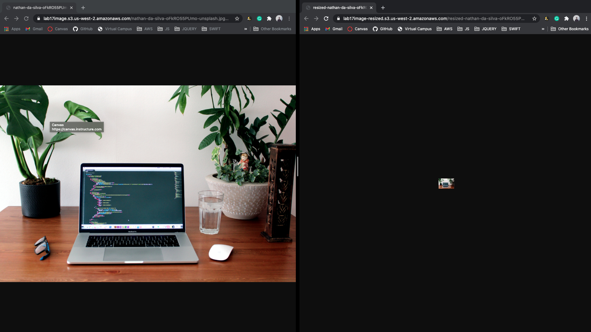

# LAB - Class 17

## Lab: S3 and Lambda

### Author: Mariko Alvarado

### Links and Resources

 - Simon,Nathan,Matt 

[DOCUMENTATION USED](https://docs.aws.amazon.com/lambda/latest/dg/with-s3-example.html)

**PROCESS**

 **SOURCE BUCKET - LAMBDA - TARGET BUCKET**

 - [x] IAM Policy
    - [x] Execution Role
 - [x] Create Function Code
 - [x] Deploy .zip File with Function Code + Dependencies
 - [x] Create Lambda Function
 - [x] Test Lambda Function
 - [x] Configure S3 to Publish events
 - [ ] Upload image in S3 console and verify thumbnail added to target bucket

I had difficulties mostly with trying to figure out why some of the commands used in CLI would not accept my secret id key. ~~The biggest issue is not being able to upload an image directly in the S3 Console and successfully trigger the lambda function.~~

**image successfully resized**

